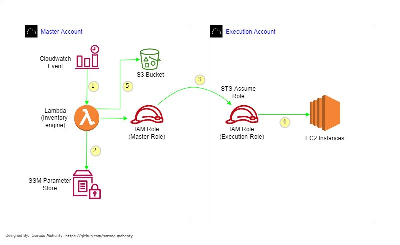

# AWS Resources Inventory Report in CSV
Objective: To get all desired AWS resources (in this case EC2 instances) details as inventory report in CSV format. This setup will scan single or multiple AWS accounts and will fetch all EC2 instances with custom tags and will store the output in S3 in csv format.
//test change added

## Architecture

1. Cloudwatch Event will trigger Lambda "inventory-engine".
2. Lambda will fetch AWS account numbers from Systems Manager (SSM) Parameter Store.
3. Lambda assumes IAM role of each account one by one and scans EC2 instances then write the captured information to runtime csv.
4. Lambda uploads the csv to S3 bucket.

## Infra Readiness Steps:
Login to master/central AWS account console:
1. Create a S3 bucket and give a unique bucket name. 
2. Go to Cloudformation and create a stack using [inventory-iam-master-role](./inventory-iam-master-role.json) which will create master IAM Role with required permissions.
3. Create a Lambda function in Python 3.9 from scratch, attach "inventory-iam-master-role" IAM Role & set Lambda timeout to 10 minutes with 128MB RAM minimum (should be sufficient to scan ~500 resources).
4. Create a SSM parameter store and add desired AWS account numbers(Execution Account) as shown below:

5. Replace "Inventory-Engine-Accounts" with your desired parameter store name in line 19 of the Lambda script or you can also keep same name :)
6. Replace "mys3bucket" with your actual bucket name in line 84 of Lambda script.
7. Create a Cloudwatch event and set target to above Lambda.

Login to Execution AWS account console:
1. Go to Cloudformation and create a stack using [inventory-iam-execution-role](./inventory-iam-execution-role.json) which will create execution IAM Role with required permissions.

Thats it!! Folks.. Now go ahead and trigger the Lambda to see the csv report.

## NOTE:
Above solution is tested and intended for testing purposes and is tested for around 80-100 resources/ec2 instances only. In case of production use do enhance and consider Lambda timeout and its scalability.
